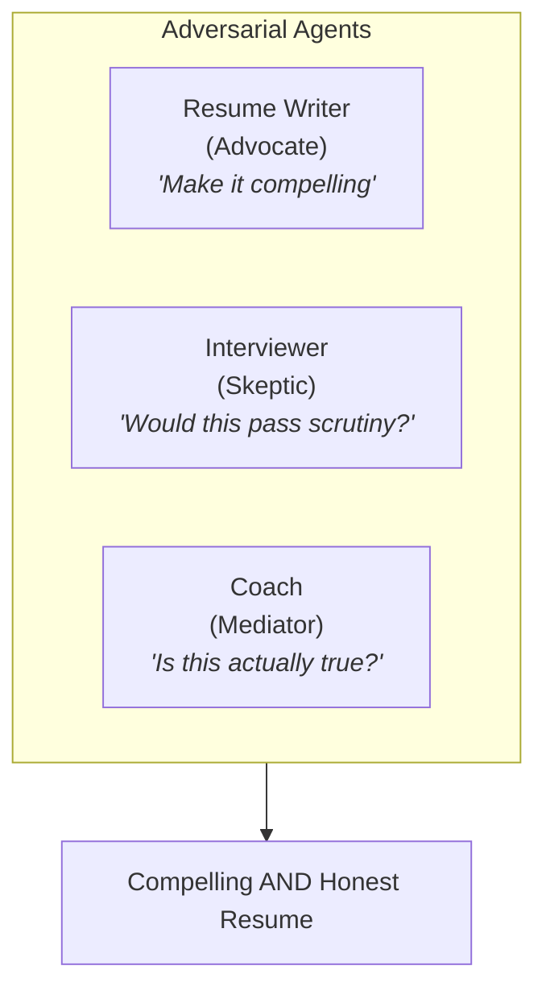
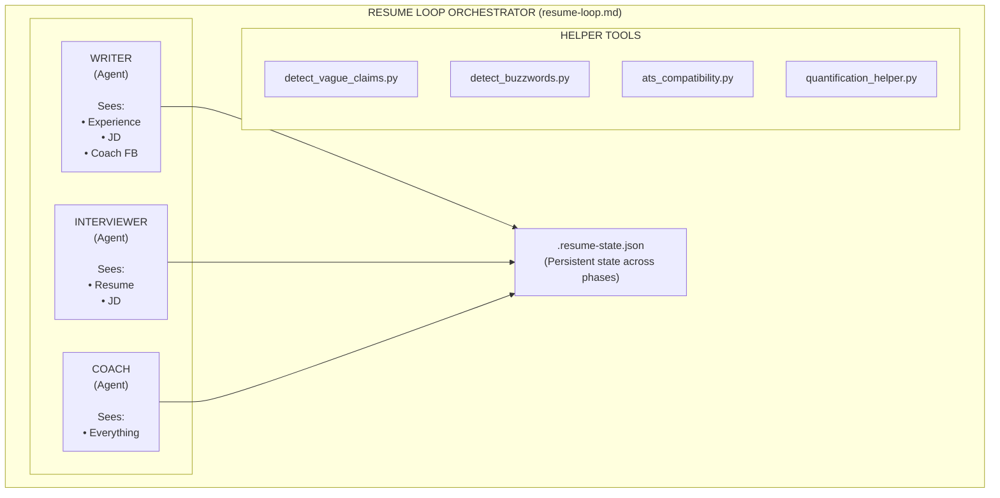
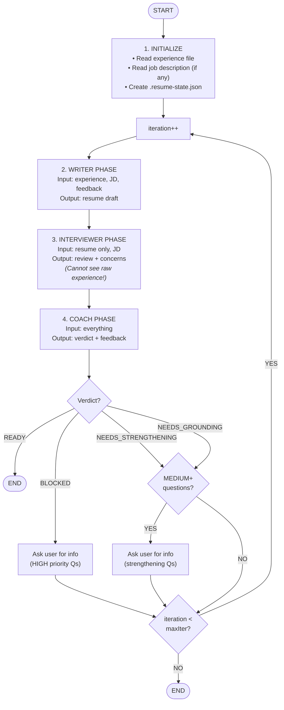
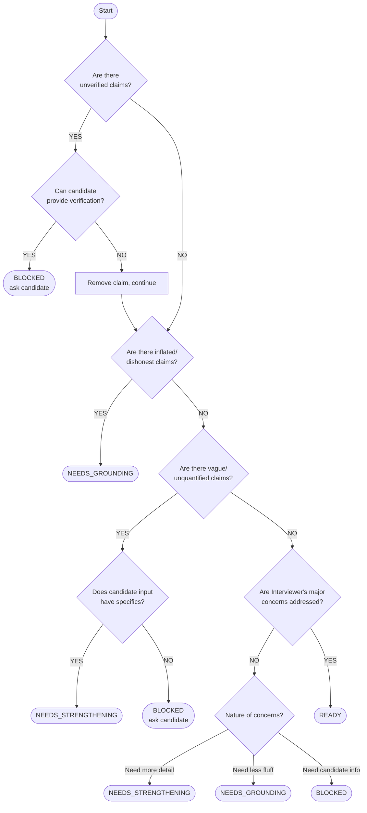

# Resume Helper Plugin

An adversarial multi-agent Claude Code plugin that creates resumes which are **both compelling AND honest** - a win-win for applicants and interviewers alike.

## Table of Contents

- [Philosophy](#philosophy)
- [Installation](#installation)
- [Quick Start](#quick-start)
- [Commands](#commands)
- [How It Works](#how-it-works)
- [The Three Agents](#the-three-agents)
- [Helper Tools](#helper-tools)
- [State Management](#state-management)
- [Examples](#examples)
- [Troubleshooting](#troubleshooting)

---

## Philosophy

Traditional resume writing suffers from two failure modes:

| Problem | Result |
|---------|--------|
| **Underselling** | Qualified candidates fail to articulate their value |
| **Overselling** | Buzzword-heavy resumes waste everyone's time |

This plugin uses **adversarial agents** to find the sweet spot:



The key insight: **information isolation**. The Interviewer agent only sees the resume (not the candidate's full story), simulating how a real hiring manager evaluates applications.

---

## Installation

See https://github.com/MadeByTokens/claude-code-plugins-madebytokens

## Quick Start

### 1. Prepare Your Input

Create a file with your raw experience (e.g., `my_experience.md`):

```markdown
# My Experience

## Current Role
Software Engineer at TechCorp (2021-present)
- Work on the backend team
- Built some APIs
- Helped improve database performance
- Mentored new engineers

## Previous Role
Junior Developer at StartupXYZ (2019-2021)
- Worked on the mobile app
- Fixed bugs
- Did code reviews

## Education
BS Computer Science, State University, 2019

## Skills
Python, JavaScript, PostgreSQL, AWS
```

### 2. (Optional) Save the Job Description

If targeting a specific role, save the job description (e.g., `job.md`):

```markdown
# Senior Backend Engineer

We're looking for an experienced backend engineer...

Requirements:
- 3+ years of backend development
- Experience with Python and SQL
- Cloud infrastructure experience (AWS preferred)
- Strong communication skills
```

### 3. Run the Resume Loop

```bash
/resume-helper:resume-loop "my_experience.md" --job "job.md"
```

### 4. Watch the Magic

The plugin will iterate through:
1. **Writer** creates/improves the resume
2. **Interviewer** critiques it (seeing only the resume)
3. **Coach** synthesizes feedback and decides next steps

This continues until the resume is "interview-ready" or max iterations reached.

### 5. Get Your Output

- `resume_final.md` - Your polished resume
- `interview_prep.md` - Preparation guide with likely questions

---

## Commands

### `/resume-helper:resume-loop`

Main command to start the adversarial resume development process.

```bash
/resume-helper:resume-loop "experience.md" [options]
```

**Options:**

| Option | Default | Description |
|--------|---------|-------------|
| `--job <file>` | none | Path to job description for targeting |
| `--max-iterations` | 5 | Maximum improvement cycles |
| `--output <file>` | `./resume_final.md` | Output path for final resume |
| `--format` | `ats` | Format: `traditional`, `modern`, `ats` |

**Examples:**

```bash
# Basic usage
/resume-helper:resume-loop "experience.md"

# With job targeting
/resume-helper:resume-loop "experience.md" --job "senior_engineer_jd.md"

# Custom options
/resume-helper:resume-loop "exp.md" --job "jd.md" --max-iterations 3 --output "./my_resume.md"
```

### `/resume-helper:resume-status`

Check the status of an active or completed loop.

```bash
/resume-helper:resume-status
```

**Output includes:**
- Current phase and iteration
- Verdict history
- Outstanding concerns
- Time elapsed

### `/resume-helper:cancel-resume`

Cancel an active loop (preserves progress).

```bash
/resume-helper:cancel-resume
```

### `/resume-helper:interview-prep`

Generate interview preparation from any resume (standalone command).

```bash
/resume-helper:interview-prep "resume.md"
```

**Output:** `interview_prep.md` with:
- Likely interview questions
- Suggested response frameworks
- Numbers to remember
- Questions to ask the interviewer

---

## How It Works

### Architecture Overview



### Loop Flow



### Information Isolation (Key Innovation)

The power of this system comes from **what each agent CAN'T see**:

| Information | Writer | Interviewer | Coach |
|-------------|--------|-------------|-------|
| Candidate's raw experience | ✓ | ✗ | ✓ |
| Job description | ✓ | ✓ | ✓ |
| Current resume | ✓ | ✓ | ✓ |
| Interviewer's concerns | ✗ | - | ✓ |
| Previous iterations | ✗ | ✗ | ✓ |

**Why this matters:**
- The **Interviewer** evaluates the resume the way a real hiring manager would - with only the resume in hand
- The **Writer** can't see specific critiques, preventing defensive writing
- The **Coach** sees everything and translates feedback constructively

---

## The Three Agents

### Resume Writer (Advocate)

**File:** `agents/resume-writer.md`

**Role:** Present the candidate in the best possible light while remaining truthful.

**Key Behaviors:**
- Uses STAR method (Situation, Task, Action, Result)
- Quantifies achievements wherever possible
- Aligns language to job description keywords
- Uses strong action verbs

**Writing Principles:**

```
BEFORE: "Worked on database optimization"

AFTER:  "Reduced database query response time by 60% (500ms → 200ms)
         by implementing query caching and index optimization,
         supporting 10x traffic growth"
```

**Constraints:**
- Cannot invent achievements
- Cannot inflate numbers
- Every claim must be interview-defensible

### Interviewer (Skeptic)

**File:** `agents/interviewer.md`

**Role:** Review the resume as a skeptical hiring manager would.

**Evaluation Framework:**

1. **6-Second Scan** - First impression test
2. **Claim Verification** - Can each bullet be verified in an interview?
3. **Pattern Detection** - Vague language, buzzwords, inflation signals
4. **Job Fit Analysis** - Alignment with requirements

**Red Flags Detected:**
- Vague language ("responsible for", "helped with")
- Buzzword overload ("synergy", "leverage", "passionate")
- Unsubstantiated claims ("improved performance" without numbers)
- Scope ambiguity ("led team" without size)

**Output Verdicts:**
- `STRONG_CANDIDATE` - Would advance to interview
- `NEEDS_WORK` - Has potential but too vague
- `RED_FLAGS` - Serious concerns

### Coach (Mediator)

**File:** `agents/coach.md`

**Role:** Synthesize feedback, verify claims, ensure honesty.

**Key Responsibilities:**

1. **Translate Feedback** - Convert Interviewer concerns to Writer guidance
2. **Verify Claims** - Cross-reference resume against candidate's input
3. **Guard Honesty** - Never allow fabrication or inflation
4. **Track Progress** - Monitor convergence across iterations
5. **Proactive Questioning** - Ask clarifying questions on EVERY iteration to strengthen claims

**Proactive Questioning:**

The Coach asks questions on every iteration, not just when blocked. Questions are prioritized:

| Priority | Meaning | Loop Behavior |
|----------|---------|---------------|
| `HIGH` | Must answer to proceed | Pauses loop, asks user |
| `MEDIUM` | Would significantly strengthen | Pauses loop, asks user |
| `LOW` | Nice to have | Included in output, doesn't pause |

Question categories include:
- **Quantification**: Team size, percentages, timelines
- **Impact**: Business outcomes, who benefited
- **Ownership**: Lead vs contributor, specific role
- **Context**: Scale, constraints, technologies

**Verdict Types:**

| Verdict | Meaning | Next Action |
|---------|---------|-------------|
| `READY` | Resume is interview-ready | Exit loop |
| `NEEDS_STRENGTHENING` | Undersold - enhance | Continue loop |
| `NEEDS_GROUNDING` | Oversold - add specifics | Continue loop |
| `BLOCKED` | Need more candidate info | Ask user |

---

## Helper Tools

Four Python utilities for objective analysis. All tools feature:
- **Python 3.8+ compatibility** (tested on 3.8-3.12)
- **Pre-compiled regex patterns** for performance
- **Comprehensive input validation** (file size, encoding, binary detection)
- **JSON output option** (`--json` flag)
- **No external dependencies** (standard library only)

### detect_vague_claims.py

Scans for language patterns that indicate vague or unquantified claims.

```bash
python plugins/resume-helper/tools/detect_vague_claims.py resume.md [--json]
```

**Features:**
- **Deduplication**: Reports only one issue per line (highest priority)
- **Priority-based matching**: More severe patterns take precedence
- **Smart exceptions**: Ignores patterns when followed by quantification (e.g., "improved X by 50%")

**Patterns Detected:**
- "led team" (without size)
- "improved X" (without percentage)
- "responsible for" (passive voice)
- "various", "multiple", "several" (vague quantities)
- "helped with", "worked on", "involved in" (understated contributions)
- "significant", "greatly", "major" (vague intensifiers)

**Output:**
```
Specificity Score: 65% (higher is better)
Total Issues Found: 8
  - High severity: 3
  - Medium severity: 4
  - Low severity: 1

[HIGH] Line 12
  Text: "Led team to improve efficiency"
  Issue: Team size not specified
  Suggestion: Specify team size: 'Led team of [N] engineers'
```

### detect_buzzwords.py

Identifies overused buzzwords and suggests alternatives.

```bash
python plugins/resume-helper/tools/detect_buzzwords.py resume.md [--json]
```

**Features:**
- **Context-aware detection**: Avoids false positives in technical contexts
  - "bandwidth" not flagged in "network bandwidth optimization"
  - "scalable" not flagged in "horizontally scalable architecture"
  - "ecosystem" not flagged in "AWS ecosystem"

**Categories:**
- Corporate jargon ("synergy", "leverage", "paradigm")
- Self-descriptive ("passionate", "driven", "team player")
- Action verb buzzwords ("spearheaded", "orchestrated")
- Vague achievements ("exceeded expectations", "proven track record")

**Output:**
```
Clarity Score: 78% (higher is better)
Total Buzzwords Found: 5

[HIGH] Line 8: "leverage"
  Category: Corporate Jargon
  Suggestion: use, apply, utilize
```

### ats_compatibility.py

Checks resume for Applicant Tracking System compatibility.

```bash
python plugins/resume-helper/tools/ats_compatibility.py resume.md [job_description.md] [--json]
```

**Features:**
- **13 keyword categories** for comprehensive JD matching:
  - Programming languages, frameworks, cloud platforms
  - DevOps tools, databases, methodologies
  - Soft skills, certifications, degrees
  - Industries, security terms

**Checks:**
- Standard sections present (Experience, Education, Skills)
- Contact information complete (email, phone, LinkedIn)
- Date formats parseable
- No problematic formatting (tables, images)
- Keyword alignment with job description (by category)

**Output:**
```
ATS Score: 85%

Sections Found: experience, education, skills, contact
Sections Missing: none

Issues Found:
[MEDIUM] No LinkedIn profile found
  Fix: Add LinkedIn URL for professional presence

Keyword Analysis (from Job Description):
Match Rate: 8/12 (67%)
Missing: kubernetes, terraform, graphql, agile
```

### quantification_helper.py

Interactive tool to help quantify achievements.

```bash
# Analyze full resume
python plugins/resume-helper/tools/quantification_helper.py resume.md [--json]

# Analyze single claim
python plugins/resume-helper/tools/quantification_helper.py --claim "Improved team productivity"
```

**Claim Types Detected:**
- Team leadership ("led", "managed", "supervised")
- Performance improvement ("improved", "increased", "enhanced")
- Reduction ("reduced", "decreased", "cut")
- Building ("built", "developed", "created", "architected")
- Migration ("migrated", "transitioned", "upgraded")
- Mentorship ("mentored", "coached", "trained")
- Launch ("launched", "shipped", "deployed")
- Automation ("automated", "streamlined", "optimized")
- Revenue ("generated", "drove", "grew")
- Problem solving ("resolved", "fixed", "debugged")
- Recognition ("won", "awarded", "received")
- Collaboration ("collaborated", "partnered")
- Documentation ("wrote", "authored", "documented")

**Output:**
```
Claim: "Improved team productivity"
Type: Performance Improvement

Questions to quantify:
  1. What specific metric improved (latency, throughput, response time)?
  2. What was the before state/baseline?
  3. What was the after state?
  4. What percentage improvement does this represent?
  5. Over what time period?
  6. How did you measure this?

Template: Improved {metric} by {percentage}% (from {before} to {after}) by implementing {action}
```

---

## State Management

### State File: `.resume-state.json`

Created in the working directory to track loop progress.

```json
{
  "active": true,
  "iteration": 2,
  "phase": "COACHING",
  "candidateInput": {
    "experiencePath": "./experience.md",
    "experience": "# My Experience\n...",
    "jobDescriptionPath": "./job.md",
    "jobDescription": "# Senior Engineer\n..."
  },
  "options": {
    "maxIterations": 5,
    "format": "ats",
    "outputPath": "./resume_final.md"
  },
  "currentResume": "# JOHN DOE\n...",
  "history": [
    {
      "iteration": 1,
      "resumeVersion": "...",
      "interviewerVerdict": "NEEDS_WORK",
      "interviewerConcerns": [
        "Line 5: Team size not specified",
        "Line 8: Impact not quantified"
      ],
      "coachVerdict": "NEEDS_GROUNDING",
      "coachFeedback": "Add team size (4 engineers) and quantify the performance improvement"
    }
  ],
  "lastVerdict": "NEEDS_GROUNDING",
  "interviewQuestions": [
    "Tell me about the migration project. What was your role?",
    "How did you measure the performance improvement?"
  ],
  "startedAt": "2024-01-15T10:30:00Z",
  "completedAt": null,
  "stoppedReason": null
}
```

### State Phases

| Phase | Description |
|-------|-------------|
| `INITIALIZED` | State created, ready to start |
| `WRITING` | Writer agent working on resume |
| `REVIEWING` | Interviewer agent evaluating |
| `COACHING` | Coach synthesizing and deciding |
| `COMPLETE` | Loop finished |
| `CANCELLED` | User cancelled |

---

## Examples

### Example 1: Basic Usage

**Input (`experience.md`):**
```markdown
Software Engineer at BigTech (2020-present)
- Built microservices
- Improved API performance
- Led a team on migration project
- Mentored junior developers
```

**Command:**
```bash
/resume-helper:resume-loop "experience.md"
```

**Output (`resume_final.md`):**
```markdown
# SOFTWARE ENGINEER

## Professional Experience

### BigTech | Software Engineer | 2020 - Present

- Architected and deployed 5 microservices handling 100K+ requests/day using Python and FastAPI, reducing system coupling and enabling independent scaling

- Optimized API response times by 45% (from 450ms to 250ms average) through query optimization, caching implementation, and database indexing

- Led team of 4 engineers in migrating legacy monolith to microservices architecture over 6 months, achieving zero-downtime deployment

- Mentored 3 junior developers through structured 1:1s and code reviews, resulting in 2 promotions within 18 months
```

### Example 2: With Job Targeting

**Command:**
```bash
/resume-helper:resume-loop "experience.md" --job "senior_backend_jd.md"
```

The resume will be optimized with keywords and emphasis aligned to the job description.

### Example 3: Coach Questions

The Coach asks proactive questions on every iteration. Here's what you might see:

**MEDIUM Priority Questions (strengthening):**
```
═══════════════════════════════════════════════════
ITERATION 2 - NEEDS_STRENGTHENING
═══════════════════════════════════════════════════

The Coach has some questions that would strengthen your resume:

[MEDIUM] For "improved API performance":
  - What was the specific metric (latency, throughput, response time)?
  - What was the percentage improvement?

[MEDIUM] For "led team":
  - How many people were on the team?

You can answer these now or skip to continue.
```

**HIGH Priority Questions (blocking):**
```
═══════════════════════════════════════════════════
ITERATION 3 - BLOCKED
═══════════════════════════════════════════════════

The Coach needs this information to proceed:

[HIGH] For "saved the company money":
  - What was the actual dollar amount or percentage?
  - This claim cannot remain without verification.

[HIGH] For "migration project":
  - What was migrated and what was the timeline?

Please provide these details to continue.
```

You provide the information, and the loop continues with your answers incorporated.

---

## Troubleshooting

### "No active loop found"

The state file doesn't exist or was deleted. Start a new loop:
```bash
/resume-helper:resume-loop "experience.md"
```

### Loop not converging

If the loop keeps iterating without reaching READY:
1. Check if your experience input has enough detail
2. The Coach may be asking for information you need to provide
3. Run `/resume-helper:resume-status` to see outstanding concerns

### Helper tools not running

Ensure Python 3.8+ is available:
```bash
python3 --version
```

### ATS score is low

Common fixes:
- Add missing sections (Experience, Education, Skills)
- Include contact information (email, phone, LinkedIn)
- Add dates to all positions
- Remove tables and images (ATS can't parse them)

---

## Command Options Reference

### `--format` Option

The `--format` option controls the resume output style:

| Format | Description | Best For |
|--------|-------------|----------|
| `ats` (default) | ATS-optimized with clean formatting, standard sections, keyword-rich | Most job applications |
| `traditional` | Classic chronological format, formal language | Conservative industries |
| `modern` | Contemporary styling, skills-first, achievement-focused | Tech, creative roles |

### `--max-iterations` Option

Controls how many Writer→Interviewer→Coach cycles to allow:
- Default: 5
- Minimum: 1 (single pass)
- Recommended: 3-5 for most resumes

Lower values = faster but may not resolve all concerns.
Higher values = more polished but diminishing returns after 5-6.

---

## State File Schema Reference

The `.resume-state.json` file tracks loop progress. Here's the complete schema:

### Required Fields

| Field | Type | Description |
|-------|------|-------------|
| `active` | boolean | Whether loop is currently running |
| `iteration` | integer | Current iteration number (0 = not started) |
| `phase` | string | Current phase (see Phase Values) |
| `startedAt` | string | ISO 8601 timestamp in UTC |

### Phase Values

| Phase | Description |
|-------|-------------|
| `INITIALIZED` | State created, loop not started |
| `WRITING` | Resume Writer agent is working |
| `REVIEWING` | Interviewer agent is evaluating |
| `COACHING` | Coach is synthesizing feedback |
| `COMPLETE` | Loop finished successfully |
| `CANCELLED` | User cancelled via command |

### Candidate Input Fields

| Field | Type | Description |
|-------|------|-------------|
| `candidateInput.experiencePath` | string | Path to experience file |
| `candidateInput.experience` | string | Raw experience content |
| `candidateInput.jobDescriptionPath` | string/null | Path to JD file (if provided) |
| `candidateInput.jobDescription` | string/null | Target JD content (if provided) |

### Options Fields

| Field | Type | Description |
|-------|------|-------------|
| `options.maxIterations` | integer | Maximum loop iterations (default: 5) |
| `options.format` | string | Resume format: ats, traditional, modern |
| `options.outputPath` | string | Output path for final resume |

### Other Fields

| Field | Type | Description |
|-------|------|-------------|
| `currentResume` | string/null | Latest resume version |
| `lastVerdict` | string/null | Most recent Coach verdict |
| `history` | array | Previous iteration records |
| `interviewQuestions` | array | Generated interview questions |
| `completedAt` | string/null | Completion timestamp |
| `stoppedReason` | string/null | Why loop ended |

### Stopped Reasons

| Reason | Description |
|--------|-------------|
| `ready` | Achieved READY verdict |
| `max_iterations` | Hit iteration limit |
| `cancelled_by_user` | User ran cancel command |
| `error` | Unexpected error occurred |

---

## Verdict Decision Tree

The Coach uses this decision tree to issue verdicts:



### Verdict Meanings

| Verdict | Resume State | Writer Action | User Action |
|---------|--------------|---------------|-------------|
| `READY` | Interview-ready | None | Review output |
| `NEEDS_STRENGTHENING` | Too modest | Add specifics | Wait |
| `NEEDS_GROUNDING` | Oversold | Remove/soften | Wait |
| `BLOCKED` | Missing info | Wait | Provide info |

---

## Edge Cases and Common Issues

### File Paths with Spaces

Always quote paths containing spaces:
```bash
# Correct
/resume-helper:resume-loop "my experience.md" --job "job description.md"

# Incorrect - will fail
/resume-helper:resume-loop my experience.md
```

### Absolute vs Relative Paths

Both are supported:
```bash
# Relative (from current directory)
/resume-helper:resume-loop "./experience.md"

# Absolute
/resume-helper:resume-loop "/home/user/resumes/experience.md"
```

### Job Description is Optional

The `--job` parameter is optional. Without it:
- Resume is optimized generically
- ATS keyword matching is skipped
- Focus is on clarity and quantification

### Handling Binary Files

The tools will reject binary files with a clear error:
```
Error: File appears to be binary, not text: resume.pdf
```

Convert PDFs to text/markdown first, or copy-paste content.

### Large Files

Files over 10MB are rejected to prevent memory issues:
```
Error: File too large: 15.2MB (max 10MB)
```

### Encoding Issues

Tools try multiple encodings (UTF-8, Latin-1, etc.). If all fail:
```
Error: Could not decode file with any supported encoding
```

Try saving the file as UTF-8.

---

## Contributing
This is a community-built plugin. Contributions welcome!


### Adding New Patterns

To add vague claim patterns, edit `tools/detect_vague_claims.py`:

```python
VAGUE_PATTERNS.append({
    "pattern": r"your regex here",
    "issue": "What's wrong",
    "suggestion": "How to fix",
    "severity": "high|medium|low"
})
```

### Modifying Agent Behavior

Edit the agent markdown files in `agents/`. Key sections:
- Role description
- Information access rules
- Output format specifications

---

## License

MIT License - see the main repository for details.

---

*Built on the adversarial multi-agent pattern from bon-cop-bad-cop*
