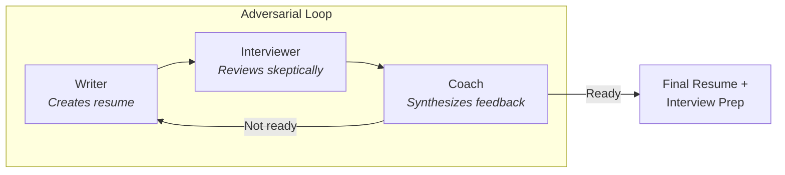

# Resume Helper Plugin

An adversarial multi-agent Claude Code plugin that creates resumes which are **both compelling AND honest**.

## Philosophy

Traditional resume writing has two failure modes:

| Problem | Result |
|---------|--------|
| **Underselling** | Qualified candidates fail to articulate their value |
| **Overselling** | Buzzword-heavy resumes waste everyone's time |

This plugin uses **adversarial agents** to find the sweet spot. Three agents with different perspectives iterate until the resume is interview-ready:

- **Writer** (Advocate) - Presents the candidate compellingly
- **Interviewer** (Skeptic) - Reviews like a real hiring manager would
- **Coach** (Mediator) - Ensures honesty and synthesizes feedback

The key insight: **information isolation**. The Interviewer only sees the resume (not the candidate's full story), simulating how a real hiring manager evaluates applications.

---

## Installation

### Option A: Via MadeByTokens Marketplace (Recommended)

See https://github.com/MadeByTokens/claude-code-plugins-madebytokens

### Option B: Direct Install

```bash
# Clone and install directly
git clone https://github.com/MadeByTokens/resume-helper.git
/plugin install ./resume-helper
```
---

## Quick Start

### 1. Prepare Your Input

Create a file with your raw experience (e.g., `my_experience.md`):

```markdown
# My Experience

## Current Role
Software Engineer at TechCorp (2021-present)
- Work on the backend team
- Built some APIs
- Helped improve database performance

## Previous Role
Junior Developer at StartupXYZ (2019-2021)
- Worked on the mobile app
- Fixed bugs

## Education
BS Computer Science, State University, 2019

## Skills
Python, JavaScript, PostgreSQL, AWS
```

### 2. Run the Resume Loop

```bash
# Basic usage
/resume-helper:resume-loop "my_experience.md"

# With job targeting
/resume-helper:resume-loop "my_experience.md" --job "job_description.md"

# Custom options
/resume-helper:resume-loop "exp.md" --job "jd.md" --max-iterations 3 --output "./my_resume.md"
```

### 3. Answer Coach Questions

The Coach will ask clarifying questions to strengthen your resume:
- Team sizes, metrics, timelines
- Specific contributions vs team work
- Business impact of your work

### 4. Get Your Output

- `resume_final.md` - Your polished resume
- `interview_prep.md` - Preparation guide with likely questions

---

## Commands

| Command | Description |
|---------|-------------|
| `/resume-helper:help` | Show all commands and options |
| `/resume-helper:resume-loop` | Main command - starts the adversarial development loop |
| `/resume-helper:resume-status` | Check status of active or completed loop |
| `/resume-helper:cancel-resume` | Cancel active loop (preserves progress) |
| `/resume-helper:interview-prep` | Generate interview prep from any resume |

### resume-loop Options

| Option | Default | Description |
|--------|---------|-------------|
| `--job <file>` | none | Path to job description for targeting |
| `--max-iterations` | 5 | Maximum improvement cycles |
| `--output <file>` | `./resume_final.md` | Output path for final resume |
| `--format` | `ats` | Format: `traditional`, `modern`, `ats` |

---

## How It Works



### Information Isolation

| Information | Writer | Interviewer | Coach |
|-------------|--------|-------------|-------|
| Candidate's raw experience | ✓ | ✗ | ✓ |
| Job description | ✓ | ✓ | ✓ |
| Current resume | ✓ | ✓ | ✓ |
| Interviewer's concerns | ✗ | - | ✓ |

The Interviewer never sees the candidate's raw input—just like a real hiring manager only sees the resume.

### Coach Verdicts

| Verdict | Meaning | Action |
|---------|---------|--------|
| `READY` | Interview-ready | Loop exits |
| `NEEDS_STRENGTHENING` | Too modest | Continue, add specifics |
| `NEEDS_GROUNDING` | Oversold | Continue, add evidence |
| `BLOCKED` | Missing info | Ask user, then continue |

---

## Helper Tools

The Coach runs Python analysis tools to provide objective metrics:

| Tool | Purpose |
|------|---------|
| `detect_vague_claims.py` | Flags unquantified language ("led team", "improved X") |
| `detect_buzzwords.py` | Identifies corporate jargon with clearer alternatives |
| `ats_compatibility.py` | Checks ATS compatibility and keyword matching |
| `quantification_helper.py` | Suggests questions to quantify achievements |

All tools support `--json` output and require no external dependencies.

---

## Example Transformation

**Before (raw input):**
```
- Built microservices
- Improved API performance
- Led a team on migration project
```

**After (final resume):**
```
- Architected 5 microservices handling 100K+ requests/day using Python and FastAPI

- Optimized API response times by 45% (450ms → 250ms) through query optimization and caching

- Led team of 4 engineers in migrating legacy monolith to microservices over 6 months with zero downtime
```

---

## Troubleshooting

**"No active loop found"** - Start a new loop with `/resume-helper:resume-loop "experience.md"`

**Loop not converging** - Check `/resume-helper:resume-status` for outstanding concerns. The Coach may need more information from you.

**Python tools not running** - Ensure Python 3.8+ is available: `python3 --version`

**File errors** - Use quoted paths for spaces, ensure files are UTF-8 text (not PDF).

---

## Contributing

Contributions welcome! Some ideas:

- **New detection patterns** for vague claims or buzzwords
- **Industry-specific keyword sets** for ATS matching
- **Bug fixes** and edge case handling
- **Documentation** improvements

---

## License

MIT License - see [LICENSE](LICENSE) for details.
