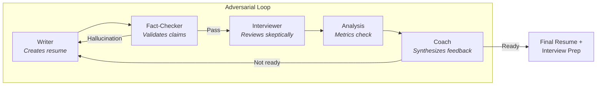

# Resume Helper Plugin

An adversarial multi-agent Claude Code plugin that creates resumes which are **both compelling AND honest**.

## Philosophy

Traditional resume writing has two failure modes:

| Problem | Result |
|---------|--------|
| **Underselling** | Qualified candidates fail to articulate their value |
| **Overselling** | Buzzword-heavy resumes waste everyone's time |

This plugin uses **adversarial agents** to find the sweet spot. Four agents with different perspectives iterate until the resume is interview-ready:

- **Writer** (Advocate) - Presents the candidate compellingly
- **Fact-Checker** (Validator) - Catches hallucinations before they spread
- **Interviewer** (Skeptic) - Reviews like a real hiring manager would
- **Coach** (Mediator) - Ensures honesty and synthesizes feedback

Two key insights:
1. **Information isolation** - The Interviewer only sees the resume (not the candidate's full story), simulating how a real hiring manager evaluates applications.
2. **Hallucination prevention** - The Fact-Checker verifies every claim against the original input, ensuring the resume only contains what you actually provided.

---

## Installation

### Option A: Via MadeByTokens Marketplace (Recommended)

See https://github.com/MadeByTokens/claude-code-plugins-madebytokens

### Option B: Direct Install

```bash
# Clone and install directly
git clone https://github.com/MadeByTokens/resume-helper.git
/plugin install ./resume-helper
```
---

## Quick Start

### 1. Prepare Your Input

Create a file with your raw experience (e.g., `my_experience.md`):

```markdown
# My Experience

## Current Role
Software Engineer at TechCorp (2021-present)
- Work on the backend team
- Built some APIs
- Helped improve database performance

## Previous Role
Junior Developer at StartupXYZ (2019-2021)
- Worked on the mobile app
- Fixed bugs

## Education
BS Computer Science, State University, 2019

## Skills
Python, JavaScript, PostgreSQL, AWS
```

### 2. Run the Resume Loop

```bash
# Basic usage
/resume-helper:resume-loop "my_experience.md"

# With job targeting
/resume-helper:resume-loop "my_experience.md" --job "job_description.md"

# With page limit (1, 2, or 3 pages)
/resume-helper:resume-loop "my_experience.md" --job "job.md" --max-pages 2

# Custom options
/resume-helper:resume-loop "exp.md" --job "jd.md" --max-iterations 3 --output "./my_resume.md"
```

> **Note:** Default is 1-page resume. Use `--max-pages 2` for 10-20 years experience, `--max-pages 3` for executives/academics.

### 3. Answer Coach Questions

The Coach will ask clarifying questions to strengthen your resume:
- Team sizes, metrics, timelines
- Specific contributions vs team work
- Business impact of your work

### 4. Get Your Output

- `resume_final.md` - Your polished resume
- `interview_prep.md` - Preparation guide with likely questions
- `resume_development_log.md` - Full audit trail of the development process
- `candidate_additions.md` - Your answers to Coach questions (preserved for future use)

---

## Commands

| Command | Description |
|---------|-------------|
| `/resume-helper:help` | Show all commands and options |
| `/resume-helper:resume-loop` | Main command - starts the adversarial development loop |
| `/resume-helper:resume-status` | Check status of active or completed loop |
| `/resume-helper:cancel-resume` | Cancel active loop (preserves progress) |
| `/resume-helper:interview-prep` | Generate interview prep from any resume |

### resume-loop Options

| Option | Default | Description |
|--------|---------|-------------|
| `--job <file>` | none | Path to job description for targeting |
| `--max-iterations` | 5 | Maximum improvement cycles |
| `--max-pages` | 1 | Maximum resume pages: 1, 2, or 3 (prompts for confirmation if not specified) |
| `--output <file>` | `./resume_final.md` | Output path for final resume |
| `--format` | `ats` | Format: `traditional`, `modern`, `ats` |

---

## How It Works



### Information Isolation

| Information | Writer | Fact-Checker | Interviewer | Coach |
|-------------|--------|--------------|-------------|-------|
| Candidate's raw experience | ✓ | ✓ | ✗ | ✓ |
| Job description | ✓ | ✗ | ✓ | ✓ |
| Current resume | ✓ | ✓ | ✓ | ✓ |
| Interviewer's concerns | ✗ | ✗ | - | ✓ |

- The **Interviewer** never sees the candidate's raw input—just like a real hiring manager only sees the resume.
- The **Fact-Checker** compares resume claims against the original input to catch any invented details.

### Coach Verdicts

| Verdict | Meaning | Action |
|---------|---------|--------|
| `READY` | Interview-ready | Loop exits |
| `NEEDS_STRENGTHENING` | Too modest | Continue, add specifics |
| `NEEDS_GROUNDING` | Oversold | Continue, add evidence |
| `BLOCKED` | Missing info | Ask user, then continue |

---

## Analysis Agents

Before each coaching phase, the system runs analysis agents in parallel that provide objective metrics:

| Agent | Purpose |
|-------|---------|
| `analyze-vague-claims` | Flags unquantified language ("led team", "improved X") |
| `analyze-buzzwords` | Identifies corporate jargon with clearer alternatives |
| `check-ats-compatibility` | Checks ATS compatibility, keyword matching, and page limits |
| `suggest-quantification` | Suggests questions to quantify achievements |

These agents run in parallel for faster analysis. Results are passed to the Coach agent who synthesizes them with the Interviewer's review to provide actionable guidance.

---

## Hallucination Prevention

The system ensures your resume only contains what you actually provided:

1. **Every claim is verified** - Numbers, achievements, technologies, dates—all traced back to your input
2. **No invented details** - If you said "led team" without a size, it stays "led team" (not "led team of 8")
3. **3-strike rule** - If the Writer hallucinates, it gets 3 attempts to fix before escalating to you
4. **Fresh file reads** - Writer and Fact-Checker read your files fresh from disk each time (not from memory). This prevents context corruption in long conversations.
5. **Answers preserved** - When you answer Coach questions, your answers are saved to `candidate_additions.md`. The Writer and Fact-Checker read this file alongside your original input, so nothing you provide gets lost.

If the Writer keeps adding invented details, you'll be asked to either:
- Provide the missing information
- Explicitly allow vague claims
- Accept the resume as-is with warnings

---

## Development Log

Every resume development session generates a detailed audit trail in `resume_development_log.md`:

- **Timestamp for each action** - Know exactly when each phase completed
- **Iteration tracking** - See how the resume evolved over multiple iterations
- **Fact-check results** - Record of all hallucination checks (pass/fail)
- **Analysis scores** - Vague claims, buzzwords, ATS compatibility scores per iteration
- **Coach verdicts** - Each verdict with summary
- **User interactions** - Questions asked and answers provided
- **Final summary** - Complete overview of the development process

This log provides full transparency into the AI's decision-making process.

---

## Example Transformation

**Before (raw input):**
```
- Built 5 microservices using Python and FastAPI, handles about 100K requests/day
- Improved API response time from 450ms to 250ms with caching
- Led team of 4 engineers on 6-month migration project, no downtime
```

**After (final resume):**
```
- Architected 5 microservices handling 100K+ requests/day using Python and FastAPI

- Optimized API response times by 45% (450ms → 250ms) through query optimization and caching

- Led team of 4 engineers in migrating legacy monolith to microservices over 6 months with zero downtime
```

> **Note:** All numbers in the final resume (5, 100K, 45%, 4, 6 months) came from the candidate's input. The Fact-Checker would reject any invented numbers.

---

## Troubleshooting

**"No active loop found"** - Start a new loop with `/resume-helper:resume-loop "experience.md"`

**Loop not converging** - Check `/resume-helper:resume-status` for outstanding concerns. The Coach may need more information from you.

**Resume too long** - Use `--max-pages 2` or `--max-pages 3` for longer resumes. The Coach will block completion if the resume exceeds the page limit.

**File errors** - Use quoted paths for spaces, ensure files are UTF-8 text (not PDF).

---

## Contributing

Contributions welcome! Some ideas:

- **New detection patterns** for vague claims or buzzwords
- **Industry-specific keyword sets** for ATS matching
- **Bug fixes** and edge case handling
- **Documentation** improvements

---

## License

MIT License - see [LICENSE](LICENSE) for details.
